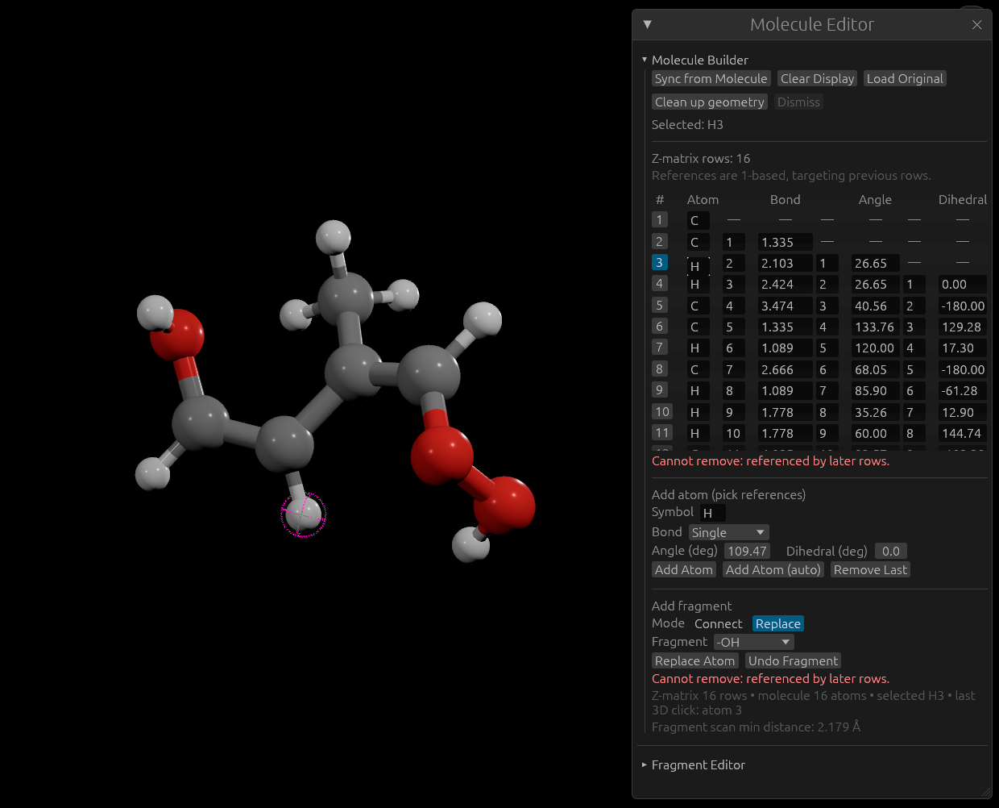
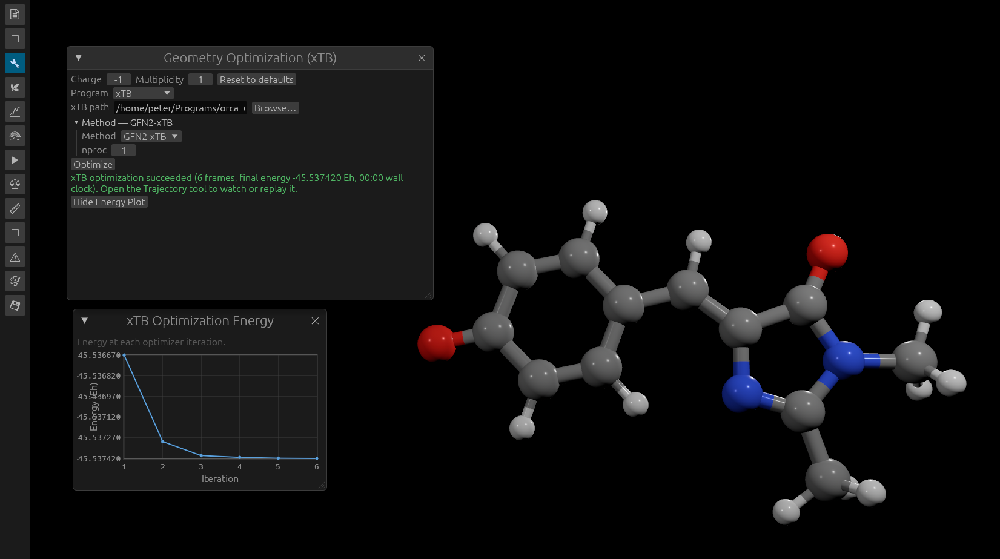
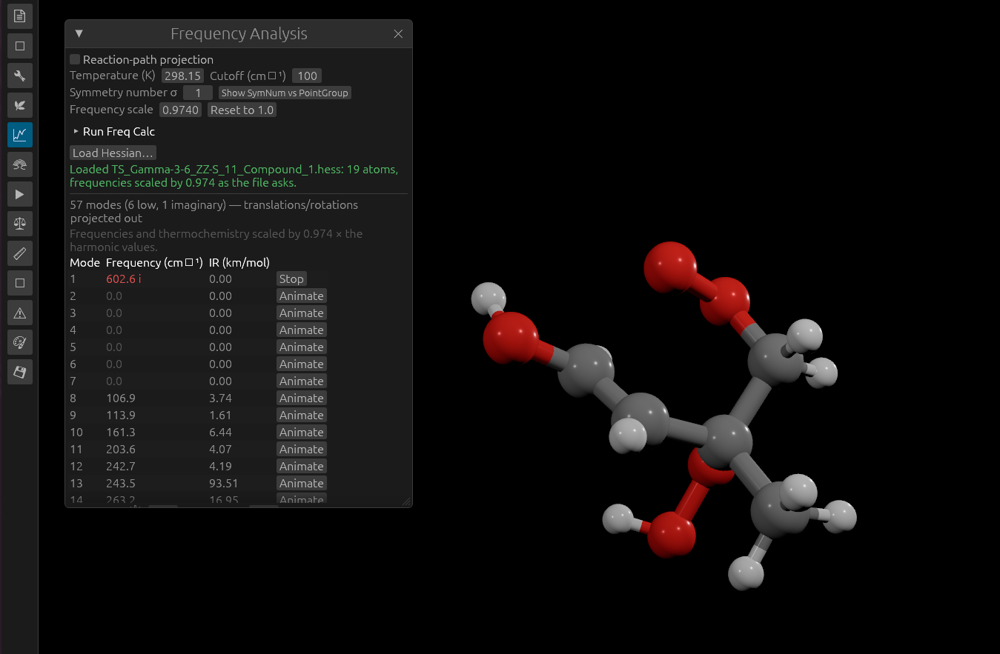
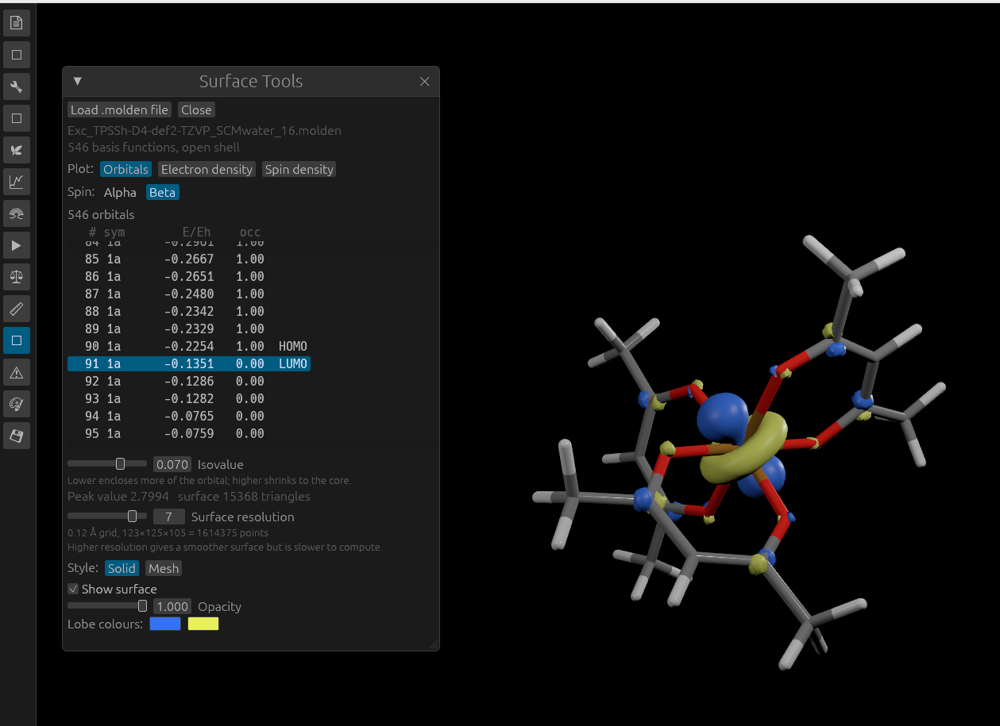
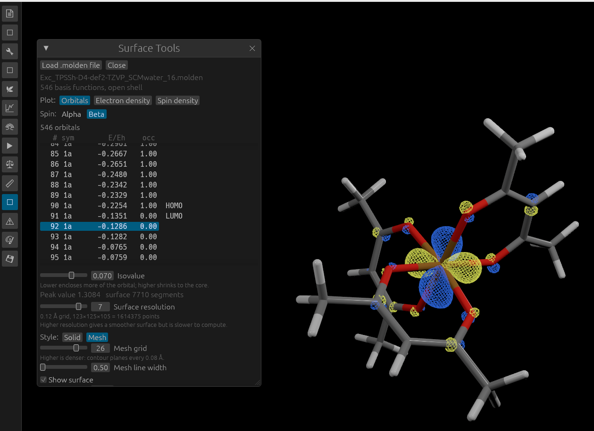
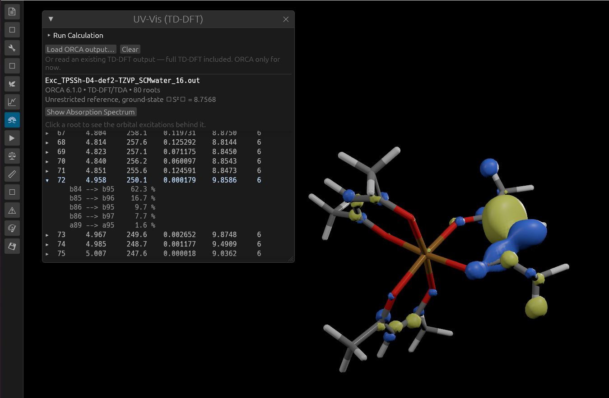
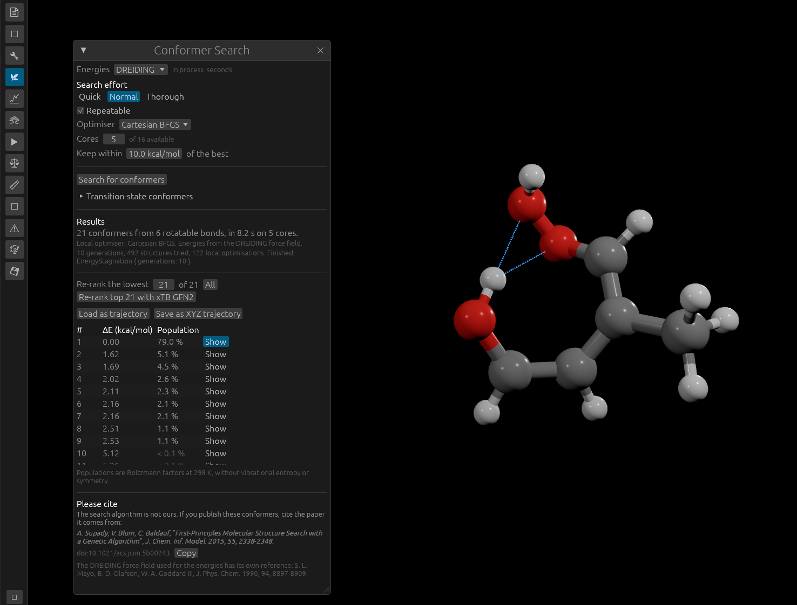
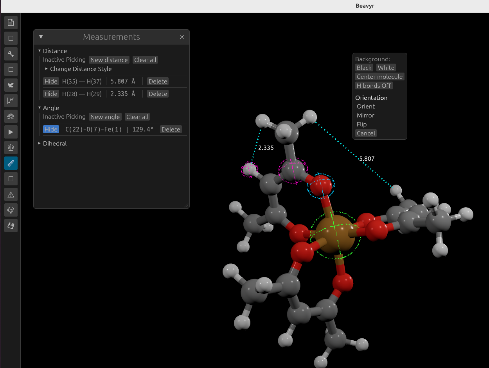

<p align="center">
  
</p>

<h1 align="center">Beavyr</h1>

Beavyr is a molecular viewer for chemists. Load a structure or build one from
scratch, watch a trajectory or a reaction play out, and see what a
quantum-chemistry calculation actually looked like — normal modes, IR and
UV-Vis spectra, molecular orbitals, conformers — all in one fast, interactive
window.

See the tools in action: [build a molecule](#molecule-editor),
[optimize its geometry](#geometry-optimization), [animate vibrations](#vibrations),
[view orbitals](#orbital-viewer), [inspect excited states](#uv-vis),
[find conformers](#conformational-analysis), or [measure a structure](#measurements).

## Download

Get the current release from the
[Releases page](https://github.com/peter88szabo/Beavyr/releases):

| Platform | File | Install |
|---|---|---|
| Windows | `beavyr-setup.exe` | Run it |
| macOS | `beavyr-macos.dmg` | Open it, drag Beavyr to Applications |
| Debian, Ubuntu, Mint | `beavyr_amd64.deb` | `sudo apt install ./beavyr_amd64.deb` |
| Arch, Manjaro | build with `packaging/PKGBUILD` | `makepkg -si` |

No Python, no separate runtime, nothing else to install. Beavyr starts and
shows the viewer with no structure loaded — it does not need xTB or any other
program to open.

## Opening files

Beavyr takes filenames on the command line and loads each into the tool that
owns it:

```sh
beavyr ZZAllyl.xyz            # structure on screen
beavyr trajectory.xyz         # several frames: trajectory, ready to play
beavyr water.hess             # frequencies already analysed
beavyr mo.molden              # orbitals loaded
beavyr excited.out            # excited states, if the file has any
beavyr mol.xyz mo.molden      # several at once, each into its own tool
beavyr --help                 # the list of formats
```

`.xyz`, `.hess`, `.molden` and `.engrad` are recognised by name. `.out` and
`.log` are written by every program in the field, so those are decided by
looking inside: a Gaussian banner means frequencies, an absorption block means
excited states. A file that is neither says so rather than opening nothing —
an ORCA `Freq` output, in particular, is told that its force constants are in
the companion `.hess`.

Anything that fails is reported both in the terminal and at the top of the
Structure panel. Beavyr still opens: a bad argument is not a reason to refuse
to start.

## What you can do

The interface is an icon rail down the side; each icon opens one window. Any
number can be open at once, and each keeps its own state.

### Molecule Editor

Open **Molecule Editor** to load or paste XYZ coordinates, or build a molecule
by adding atoms and fragments. Select an atom in the viewer to work on it;
the Z-matrix table lets you edit bond lengths, angles and dihedrals.



The atom count, molecular formula in Hill notation (`C12 : H24 : O2`) and
molecular weight sit at the top of the panel — the cheapest way to notice that
a structure is one hydrogen short before doing anything else with it. An
unknown element symbol suppresses the weight and is named, rather than
quietly producing a weight that is too small.

Load or paste XYZ. Edit the coordinates as text and re-apply, or edit the
molecule directly in 3D. The builder adds and removes atoms, attaches
fragments with chemistry-aware placement (VSEPR geometry and valency, not just
a bond vector), sets distances and angles numerically, rotates about a bond,
and undoes each of those. Sixteen fragments ship with it: `-CH3 -OH -NH2
-Phenyl -Pyrrole -OCH3 -COOH -NO2 -OOH -CCH -CycloPentane -CycloHexane -Cl -Br
-I -SH`.

A Z-matrix editor works alongside the Cartesian view — build in internal
coordinates, convert either way.

**Add missing H** fills saturated sp3 carbon to four bonds and neutral oxygen
to two, using the same chemically aware placement as **Add Atom (auto)**.
It keeps existing coordinates fixed and skips centres with detected multiple
or partial bonds. **Undo H addition** restores the structure before the addition;
use **Save to history** to keep an edited version between sessions.

**Clean up geometry** relaxes bond lengths and angles a fragment left
strained, using a force field built into Beavyr — no external program, no
waiting. It is a starting structure for a real optimisation, not a substitute
for one, and it says so.

The atom context menu also offers **Delete atom** beside **Use as rotation
center**. Deletion keeps the remaining Cartesian coordinates fixed and recreates
the Z-matrix, including when later rows referenced the deleted atom.
Clearing, replacing, or editing the geometry also removes orbital/density
surfaces that belong to the previous structure.

Right-click the background for the whole-molecule tools: recentre the view,
toggle hydrogen bonds, and **Orient / Mirror / Flip** the structure into a
chosen coordinate plane or about a chosen axis. Orient and Flip keep a chiral
molecule as it was; Mirror deliberately gives you its enantiomer.

### Geometry Optimization

Relax the displayed structure with xTB, Behemoth, or the built-in DREIDING
force field. Optimization runs in the background so the viewer stays responsive.

1. Load or draw a molecule, then open **Geometry Optimization** using the wrench
   icon on the left.
2. Choose the **Program** and method. For an external program, use **Browse…**
   to select its executable. Check the structure's **Charge** and **Multiplicity**
   before starting, and set **nproc** to the number of cores you want to use.
3. Click **Optimize**. After completion, open **Trajectory** to inspect the
   optimization steps, or **Show Energy Plot** to see the energy history when
   available. Use **Save to history** in Molecule Editor to retain the result.



### Recent Structures

The **↶ Recent Structures** icon keeps the last 20 distinct structures, newest
first. Loading another structure or pressing **Clear Display** preserves the
structure you are leaving, including unsaved drawings and edits. The newly
loaded standalone structure is saved too. Click **Load** beside an entry to
put its coordinates back on screen.

Editing and trajectory playback do not create history entries. Use **Save to
history** at the top of **Molecule Editor** to keep a particular edited or
optimized version; an optional name helps distinguish versions. A paused
trajectory frame can also be saved explicitly with this button.

Snapshots are written immediately as XYZ coordinates in the configuration
directory, so they survive restarts and remain available in another Beavyr
window. Windows merge their saved entries and retain the newest 20; reopening
a structure moves it to the top without adding a duplicate. On Linux the files
are in `$XDG_CONFIG_HOME/beavyr/structure_history` or
`~/.config/beavyr/structure_history`; on Windows they use
`%APPDATA%/Beavyr/structure_history`, and on macOS
`~/Library/Application Support/Beavyr/structure_history`.

### Trajectory

Plays multi-frame XYZ — MD, optimisation paths, IRC, a set of conformers — 
forwards or backwards, looping, at a chosen frame rate, with a frame slider.

Frames can also be overlaid on the current structure rather than played: a
solid overlay and a transparent "ghost" overlay, each with its own stride, so
a 100-frame optimisation can be shown as every tenth frame ghosted behind the
final geometry.

### Vibrations

Animate any normal mode at a chosen amplitude and frame rate — the fastest way
to see whether a calculated frequency is the stretch, bend, or torsion you
expected. Run a frequency calculation yourself (through xTB, or the built-in
force field for a quick check) or load a Hessian someone else computed.

* **Normal modes** — mass-weighted Hessian, Eckart projection to remove
  translation and rotation.
* **Reaction-path projection** — supply a gradient and the mode along the
  reaction path is projected out too, which is what you want at a transition
  state.
* **IR spectrum** — intensities from the program's own dipole derivatives,
  broadened as Gaussian, Lorentzian, Voigt or plain sticks, with adjustable
  width and a frequency scaling factor. Exportable as `.dat`.
* **Thermochemistry** — ZPE, thermal corrections, entropy and free energy at a
  chosen temperature, using Grimme's quasi-RRHO treatment of low-lying modes
  with a settable cutoff. The rotational symmetry number must be stated rather
  than guessed; a point-group reference table is built into the panel.

Use **Load Hessian…** to open a supported frequency file, then click
**Animate** beside a mode to see the corresponding molecular motion.



### Orbital Viewer

Loads a `.molden` file, evaluates the Gaussian basis on a grid, and meshes an
isosurface by marching cubes. Three quantities: a single molecular orbital,
the total electron density, or the spin density. Adjustable isovalue, grid
resolution, opacity, per-lobe colours, and a wireframe overlay. The sampled
field is retained, so dragging the isovalue slider only re-meshes rather than
re-evaluating the basis from scratch.

Open **Surface Tools**, click **Load .molden file**, and choose **Orbitals**,
**Electron density**, or **Spin density**. For an orbital, select a row in the
list and, for an open-shell calculation, choose **Alpha** or **Beta** spin.
Adjust **Isovalue** and **Surface resolution**, then choose **Solid** or **Mesh**.

*Solid view with the selected orbital and separate colours for its two phases.*



*Mesh view; use the mesh grid and line-width controls to adjust its appearance.*



### UV-Vis

Reads excited states — energies and oscillator strengths — from an ORCA
TD-DFT output, and plots the absorption spectrum against wavelength or energy
with the same four line shapes UV-Vis needs, over a settable energy window.
Export the curve for a figure.

Click **Load ORCA output…** to load excited states, expand a state to inspect
its orbital contributions, or click **Show Absorption Spectrum** to plot them.
Load the corresponding Molden file in **Surface Tools** to inspect the orbitals.



### TS Generation

The **⇌ TS Generation** button on the left icon rail opens RDA and Poor Man's
NEB. Both use the Rust optimizers imported from Behemoth, with energy and
gradient calculations supplied by an installed xTB or Behemoth executable.

**How To Use** opens a guide with atom-number examples for every Reaction
definition, active atoms, alignment, coordinate weights, and the complete
workflow. Detailed RDA option explanations are in a section that starts collapsed.

1. Use **Load A/B XYZ** to load endpoint files, or draw/optimize the molecule
   in the viewer and press **Use current as A** (reactant). Then draw/optimize
   the second structure and press **Use current as B** (product). Each stored
   endpoint has a green loaded marker and a **Show A/B** button to display it
   again. Captures stay unchanged while you edit or optimize the viewer; capture
   again to keep those changes. Both endpoints must have the same atoms in the
   same order.
2. Define the reaction using one-based atom numbers: a bond change (two atoms),
   atom transfer (donor, transferred atom, acceptor), an angle, a dihedral, or
   custom reactive bonds/angles/dihedrals. RDA also supports Cartesian motion
   on selected active atoms. Active atoms select the distance/alignment subset;
   they are not frozen-atom constraints.
3. Select RDA or Poor Man's NEB and configure the backend, method, charge and
   multiplicity. RDA exposes beta bracketing, gamma search, distance and energy
   tolerances, coordinate mode and step limits in a section that starts collapsed.
   Poor Man's NEB exposes image
   count, constrained relaxation limits and additional connectivity.
4. Generate, then use **Show TS guess** or **Show path in Trajectory** to inspect
   the result. Calculations run in the background and can be cancelled.

**Save TS guess XYZ** writes one structure in Å. **Save NEB trajectory XYZ**
writes the complete multi-frame XYZ path, including both endpoints and all
constrained-relaxed interior images; each frame's comment includes its energy,
convergence status and whether it is the selected TS guess. The highest-energy
interior image is selected. **Plot NEB energy** opens a resizable energy plot
of all images, including A and B, relative to A in kJ/mol. The selected TS is
marked; hovering over an image shows its absolute and relative energies.
The NEB energy profile and RDA search structures
also have separate save buttons. These outputs are TS guesses; saddle-point
optimization and a frequency check are needed to establish a transition state.

### Conformational Analysis

Finds the low-energy shapes a flexible molecule can take, searching over its
rotatable bonds and, for a five- or six-membered ring, its pucker — a chair
against a twist-boat, or a sugar's envelopes and twists, not only what one
bond does. Runs on the built-in force field by default (seconds, no external
program), or on xTB — GFN-FF, GFN1, or GFN2 — for a slower, more careful
ranking of the same conformers.

Results load straight into the Trajectory tool to step through, or export as
a multi-frame XYZ. A "re-rank with xTB" button lets you sharpen the ordering
of just the best few conformers after a quick built-in search finds them.

For a transition state, the same tool can search over reactant conformers and
push each one over its barrier with an artificial force, collecting a set of
transition-state guesses that can have genuinely different active-bond
lengths — not the single length a conventional constrained search would be
stuck with.

Open **Conformer Search**, choose the energy method and search effort, then
click **Search for conformers**. Use **Show** beside a result to inspect it,
**Load as trajectory** to browse the set, or **Save as XYZ trajectory** to export it.



### Measurements

Distances, angles and dihedrals by clicking atoms. Left-drag orbits the
camera, so a click is distinguished from a drag by how far the pointer
travelled. Per-measurement and global styling, labels drawn next to the line.

Open **Measurements** and choose **New distance**, **New angle**, or the
dihedral control, then click two, three, or four atoms respectively. Use
**Hide** or **Delete** beside a measurement to manage the labels on screen.



### Representation and Appearance

Six representations: ball-and-stick, rounded sticks, low-resolution balls and
lines, lines only, backbone trace, space-filling. Per-element visibility
filters, atom and bond scaling, bond radius as a fraction of the smaller
covalent radius, uniform or atom-split bond colours.

Colour schemes: CPK, Jmol, VMD, Molden, Molden0, or a custom scheme you name,
save, and optionally load at startup. Material controls (metallic, roughness,
reflectance, emissive), an ambient light and a key/fill/rim rig, background
colour.

Hydrogen bonds are detected on a distance cutoff and drawn as dashed lines
with their own colour, thickness and dash geometry.

### Also included

* **Structure Comparison** — RMSD between frames or loaded structures, as
  placed and after optimal superposition. Pin any frame as the reference and
  see which atom moved furthest.
* **Diagnostics** — flags structures that are probably wrong before you spend
  time on them: close contacts, isolated atoms, and bond orders that sit
  between an element's common valences (a likely missing hydrogen), including
  a check for an odd number of electrons that means the molecule is a
  radical.
* **Export Image** — PNG or JPEG of the viewport, or of a selected area of
  it.

## File formats

| Format | Read | Write |
|---|---|---|
| XYZ (single and multi-frame) | ✅ | ✅ |
| Molden | ✅ orbitals, basis, density | ✅ |
| ORCA `.hess` | ✅ Hessian, geometry, masses, frequencies, IR | — |
| ORCA `.engrad` | ✅ Cartesian gradient | — |
| ORCA output (`.out`) | ✅ excited states | — |
| Gaussian `.log` | ✅ frequencies, IR intensities, normal modes¹ | — |
| Turbomole `hessian` / `vibspectrum` (xTB) | ✅ | — |
| Spectra, thermochemistry | — | ✅ `.dat` |
| Viewport | — | ✅ PNG, JPEG |

¹ A plain Gaussian `Freq` job does not write the force-constant matrix; that
needs `iop(7/33=1)` or a formatted checkpoint. Beavyr reads the frequencies and
modes Gaussian printed.

## xTB

Beavyr's own force field handles geometry cleanup and conformer searching with
nothing to install. For quantum-chemistry results — optimisation, frequencies,
a better conformer ranking — point Beavyr at an
[xTB](https://xtb-docs.readthedocs.io/) executable once and the path is
remembered. Beavyr also reads output that **ORCA** or **Gaussian** already
produced; those are jobs you run yourself, not something a viewer launches.

## License

GPL-3.0. See `LICENSE`.

## Building from source

```sh
cargo run                                       # dev build, dynamic linking, fast rebuilds
cargo build --release --no-default-features     # standalone binary, no dynamic linking
cargo test -- --test-threads=1                   # run the tests serially
```

Cargo is limited to four build jobs by `.cargo/config.toml`. For a hard limit
of four CPU cores on Linux, prefix build, test and run commands with
`taskset -c 0-3` (or four CPU IDs allowed on your machine). Launched calculations
inherit that CPU limit.

The `dev` feature (on by default) enables Bevy's dynamic linking. Turn it off
for anything you intend to ship. Dependencies are built at `opt-level = 3`
even in a dev profile, because an unoptimised wgpu makes the viewer unusable.

Bevy is built with its 2D, 3D and UI features, with audio disabled at compile
time. Linux builds and packages therefore do not require ALSA.

Beavyr links no quantum-chemistry code of its own. Every external backend is
an executable you point it at, run in a scratch directory and parsed back
from its output files. That keeps the dependency list to five crates —
`bevy`, `bevy_egui`, `rfd`, `ndarray`, `anyhow` — with no BLAS and no Python.


## Implemented but not yet exposed

`src/vibronic/` is complete and tested but has no panel attached to it yet:

* **Franck-Condon activity** — projects an excited-state gradient taken at the
  ground-state geometry onto the ground-state normal modes, giving each mode's
  displacement, Huang-Rhys factor and resonance-Raman intensity in the
  short-time approximation. It needs no excited-state optimisation, which
  matters when an excited-state minimum is hard to converge.
* **Duschinsky rotation** — how the modes of one electronic state are built
  from the modes of another, for asking which ground-state mode an
  excited-state band descends from.

## Roadmap

- Simulated NMR spectra
- A UI for the vibronic analyses above
- File associations, so double-clicking an `.xyz` opens Beavyr
