<p align="center">
  
</p>

<h1 align="center">Beavyr</h1>

Beavyr is a molecular viewer for chemists. Load a structure or build one from
scratch, watch a trajectory or a reaction play out, and see what a
quantum-chemistry calculation actually looked like — normal modes, IR and
UV-Vis spectra, molecular orbitals, conformers — all in one fast, interactive
window.

See the tools in action: [build a molecule](#molecule-editor),
[optimize its geometry](#geometry-optimization), [animate vibrations](#vibrations),
[view orbitals](#orbital-viewer), [inspect excited states](#uv-vis),
[find conformers](#conformational-analysis), or [measure a structure](#measurements).

**Author:** Peter Szabo
**Affiliations:** KU Leuven & BIRA-IASB, Belgium
**Join Discord:** https://discord.gg/bA32eVnCQ 

## Download

Get the current release from the
[Releases page](https://github.com/peter88szabo/Beavyr/releases):

| Platform | File | Install |
|---|---|---|
| Windows | `beavyr-setup.exe` | Run it |
| macOS | `beavyr-macos.dmg` | Open it, drag Beavyr to Applications |
| Debian, Ubuntu, Mint | `beavyr_amd64.deb` | `sudo apt install ./beavyr_amd64.deb` |
| Arch, Manjaro | build with `packaging/PKGBUILD` | `makepkg -si` |

No Python, no separate runtime, nothing else to install.

## What you can do

The interface is an icon rail down the side; each icon opens one window. Any
number can be open at once, and each keeps its own state.

### Molecule Editor

Load or paste XYZ coordinates through **Structure (XYZ)**, then open
**Molecule Editor** to edit the structure or build one by adding atoms and
fragments. Select an atom in the viewer to work on it; the Z-matrix table lets
you edit bond lengths, angles and dihedrals.

The editor opens as a floating, resizable window. Common elements
and fragments are one click away; search the fragment library by name or formula.
The selection card identifies the atom that **Add** or **Replace** will act on,
and Undo/Redo and the geometry tools stay visible while the library scrolls.
Drag it wherever you prefer, or choose **Dock** to attach it to the right edge.
Use **Float** to detach it again.

After attaching or replacing a fragment, the existing **Newly Placed Fragment**
controls are ready to rotate, stretch and bend it. **Fragment Editor ↗** opens
the existing tool with that fragment's atoms and attachment axis already set.
Its controls and Apply/Cancel behavior are unchanged.

**Peptide Builder…** opens a separate floating window with 22 amino-acid tiles,
sequence input, N- or C-terminal growth, protonation choices and a rotatable
preview. Build a separate peptide or extend a selected free amino/carboxyl group.
Insertion is undoable and prepares the existing Fragment Editor for the new
atoms. Its **Edit residues** tab adds previewed residue replacement, side-chain
fitting, ACE/NME caps, positioned disulfide links and PDB export. Residue chemistry
survives project save/load and Undo/Redo; **Add missing H** restores named peptide
hydrogens and now supports neutral amine/amide nitrogen in ordinary structures.
Peptides hide hydrogen bonds, and chains longer than 20 residues default to a
backbone trace. **Structure → Open structure…** and command-line file opening
accept PDB/mmCIF proteins, retaining residue identifiers and recorded covalent
links. The Peptide Builder's **Edit residues** tab also offers φ/ψ/ω edits,
range presets, a clickable Ramachandran plot, and clash-ranked Dunbrack rotamers
with nearby side-chain repacking. Every conformational edit previews before an
undoable Apply. See the [Peptide Builder guide](data/amino_acids/PEPTIDE_BUILDER.md).

Protein import uses `pdbtbx` 0.12; rotamers use `dunbrack` 0.1 and its embedded
2010 tables. Both are Rust dependencies; there is no Python, runtime download or
new runtime configuration. The tables increase the binary's data footprint and
make the first compilation slower. Parser parallelism is disabled; builds and
tests remain limited to four cores.

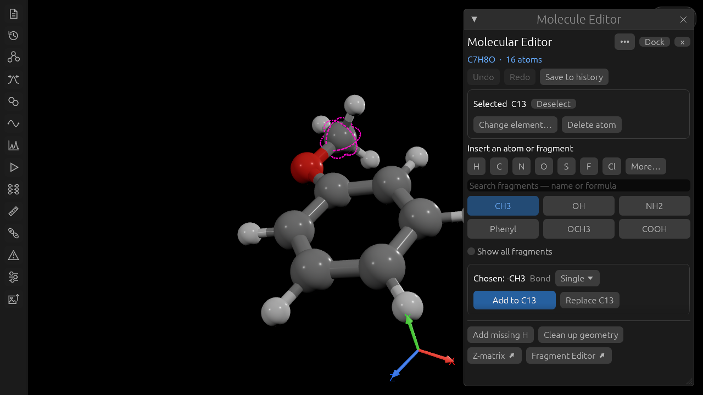

The atom count and molecular formula in Hill notation (`C12H24O2`) sit at the
top of the modern panel; hover the formula for the molecular weight. This is
the cheapest way to notice that a structure is one hydrogen short before doing
anything else with it. An unknown element symbol suppresses the weight and is
named, rather than quietly producing a weight that is too small.

Load or paste XYZ. Edit the coordinates as text and re-apply, or edit the
molecule directly in 3D. The builder adds and removes atoms, attaches
fragments with chemistry-aware placement (VSEPR geometry and valency, not just
a bond vector), sets distances and angles numerically, rotates about a bond,
and undoes each of those. Sixteen fragments ship with it: `-CH3 -OH -NH2
-Phenyl -Pyrrole -OCH3 -COOH -NO2 -OOH -CCH -CycloPentane -CycloHexane -Cl -Br
-I -SH`.

A Z-matrix editor works alongside the Cartesian view — build in internal
coordinates, convert either way.

**Add missing H** fills saturated sp3 carbon to four bonds and neutral oxygen
to two, using the same chemically aware placement as **Add Atom (auto)**.
It keeps existing coordinates fixed and skips centres with detected multiple
or partial bonds. **Undo H addition** restores the structure before the addition;
use **Save to history** to keep an edited version between sessions.

The Molecular Editor's **Select** menu selects by element, connected fragment,
bonded neighbours, or the last placed fragment. Click replaces the selection;
**Shift-click** toggles atoms. The menu also offers **All visible**, **Invert**,
and **Clear selection**. The original dashed magenta rings show selected atoms. The active atom remains
the attachment target for the existing placement controls.

**Freeze** fixes selected atoms for quick cleanup; amber boxes mark them.
The **Frozen** menu unfreezes selected atoms or all atoms. **Isolate** hides
unselected atoms, bonds and labels; **Show all** restores them. Isolation affects
the view and picking only: calculations still use the complete molecule.
Selection, isolation and freezing are session tools and are reset when a new
structure is loaded. Appending fragments preserves freezes on existing atoms.
These tools do not change the Fragment Editor's ordered picks or transformations.

**Clean up geometry** opens a floating DREIDING cleanup window. Choose **Whole
structure** or **Selected atoms**, then **Preview cleanup**. Frozen atoms always
stay fixed; in selected mode all unselected atoms stay fixed too. The built-in
force field runs in the background and can be cancelled. Cyan outlines show the
proposed geometry and displacement without changing the current coordinates.
**Accept cleanup** records one Undo/Redo step; **Discard** or closing the window
leaves the molecule unchanged. Changes to the source geometry or movable atoms
invalidate the preview. Dummy atoms are retained, fixed, outside the force field.
Cleanup reports energy change and convergence, and rejects unsupported atom
types. It prepares a starting structure for optimisation; metal coordination,
unusual bonding and electronic states require a suitable quantum method.

The atom context menu also offers **Delete atom** beside **Use as rotation
center**. Deletion keeps the remaining Cartesian coordinates fixed and recreates
the Z-matrix, including when later rows referenced the deleted atom.
Clearing, replacing, or editing the geometry also removes orbital/density
surfaces that belong to the previous structure.

The **Structure (XYZ)** panel keeps file actions in a compact toolbar and gives
the remaining window space to coordinates. The atom count and formula share
one line; hover over it for molecular weight and the file path. **View** contains
atom labels, hydrogen bonds and centering. Editing keeps **Apply coordinates**,
**Reset**, and **Clear** visible below the scrollable draft.

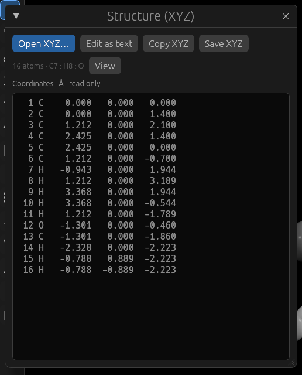

Right-click the background for the whole-molecule tools: recentre the view,
choose **Representation**, toggle hydrogen bonds, or open **Orientation** for
**Orient to plane**, **Mirror across plane**, and **Flip around axis**. Orient
and Flip keep a chiral molecule as it was; Mirror gives you its enantiomer.

### Projects and custom fragments

Use **Structure (XYZ) → Project → Save project…** to write a `.beavyr` file.
It embeds the structure, trajectory, calculation settings and manual input,
Molden orbitals, frequency results and their Hessian or imported modes, UV–Vis
results, spectrum settings, camera, appearance and window layout. Original data
files are not needed to reopen it. **Open project…** validates the saved data
before replacing the session; **Restore previous session** reverses that open.
Calculations must be stopped before opening, and restored playback starts paused.
Executable paths stay local to the installation. Calculation log files, scratch
artifacts, conformer search results and measurement annotations are not part of
this project format; save those separately using their tools.

In Molecular Editor, open **My fragments → Save molecule as fragment…**.
A **name is required**: it becomes the button used to select the fragment later.
Choose **Whole molecule** or **Selected atoms**, then the **Attachment atom**.
Atom selections accept ranges such as `1-6, 9`; **Add picked atom** uses the
viewport selection, and **Use edited fragment** uses the current Fragment
Editor selection. Select a saved button, then **Place**, **Add** or **Replace**
through the existing placement controls. Attached fragments use the existing
Fragment Editor, including translation, rotation and dihedral adjustment, and
placement supports Undo/Redo. Right-click a saved button to remove it; **Undo
removal** restores the most recently removed entry.

The library is saved per user under `~/.config/beavyr/fragments` on Linux
(`$XDG_CONFIG_HOME/beavyr/fragments` when set), `%APPDATA%/Beavyr/fragments` on
Windows, or `~/Library/Application Support/Beavyr/fragments` on macOS. Names
must be unique within the library. Projects and fragments use versioned RON
serialization through `serde`/`ron`; egui persistence stores the window layout.

### Quantum Chemistry

Open the atom-shaped launcher beside the Molecule Editor launcher. The modern
calculator opens floating; **Dock** attaches it to the right edge and **Float**
detaches it again. The **Quantum chemistry code** selector stays at the top,
with all eight existing backends and **Configure…** beside it. Its status tells
you whether the executable or Python environment is available.

Choose **Energy**, **Optimize**, **Frequencies**, or **Optimize + frequencies**;
**More…** offers the other supported calculations. Search the program's method,
functional and basis lists by name or keyword. Charge, multiplicity, CPU cores
and memory stay visible above the scrolling settings. Additional options
expand when needed; manual input opens in a separate editor. The action and status stay at the
bottom while the settings scroll, and resources are limited to four cores.

The **Classic** option restores the previous calculator form. Both layouts use
the same code selection, settings, custom input and running calculation. For
Classic from startup, launch with `BEAVYR_CLASSIC_QC=1`.

**Edit input…** opens a large, resizable editor with **Save input…**, **Run input**,
**Sync from settings**, and **Close editor**. Closing keeps the draft active.
Sync replaces it with input generated from the current controls and molecule;
**Use settings** returns to generated input while retaining the manual draft.

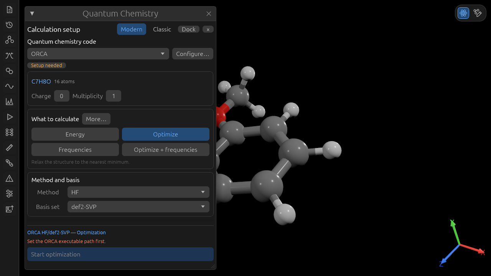

The main application title includes the version declared in `Cargo.toml`,
for example **Beavyr 0.2.1**.

The toolbars use consistent vector icons with hover labels and blue highlights
for open tools. They stay sharp at different display scales and do not depend
on emoji fonts.

### Geometry Optimization

Relax the displayed structure with xTB or the built-in DREIDING
force field. Optimization runs in the background so the viewer stays responsive.

1. Load or draw a molecule, open **Quantum Chemistry** from the atom-shaped
   launcher, and choose **Optimize**.
2. Choose the code and method. For an external program, use **Configure…** and
   **Browse…** to select its executable. Check the structure's **Charge** and
   **Multiplicity** before starting, and set **CPU cores** and **Memory (MB)**
   directly in the setup header.
3. Click **Start optimization**. After completion, open **Trajectory** to inspect the
   optimization steps, or **Show Energy Plot** to see the energy history when
   available. Use **Save to history** in Molecule Editor to retain the result.

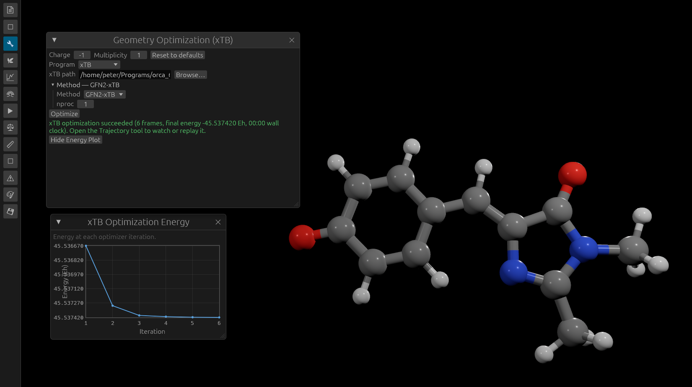

### Recent Structures

The **Recent Structures** icon keeps the last 20 distinct structures, newest
first. Loading another structure or pressing **Clear Display** preserves the
structure you are leaving, including unsaved drawings and edits. The newly
loaded standalone structure is saved too. Click **Load** beside an entry to
put its coordinates back on screen.

Search by name or formula. Each saved version has a compact card showing its
name, composition and age, with **Load** alongside it.

Editing and trajectory playback do not create history entries. Use **Save to
history** at the top of **Molecule Editor** to keep a particular edited or
optimized version; an optional name helps distinguish versions. A paused
trajectory frame can also be saved explicitly with this button.

Snapshots are written immediately as XYZ coordinates in the configuration
directory, so they survive restarts and remain available in another Beavyr
window. Windows merge their saved entries and retain the newest 20; reopening
a structure moves it to the top without adding a duplicate. On Linux the files
are in `$XDG_CONFIG_HOME/beavyr/structure_history` or
`~/.config/beavyr/structure_history`; on Windows they use
`%APPDATA%/Beavyr/structure_history`, and on macOS
`~/Library/Application Support/Beavyr/structure_history`.

### Trajectory

Plays multi-frame XYZ — MD, optimisation paths, IRC, a set of conformers — 
forwards or backwards, looping, at a chosen frame rate, with a frame slider.

The panel separates **Trajectory file**, **Playback**, and **Frame overlays**.
Use **First**, **Previous**, **Next**, and **Last** to navigate, or **Play** and
**Play backward** for motion. Playback modes and speed remain beside the controls.

Frames can also be overlaid on the current structure rather than played: a
solid overlay and a transparent "ghost" overlay, each with its own stride, so
a 100-frame optimisation can be shown as every tenth frame ghosted behind the
final geometry.

### Vibrations

Animate any normal mode at a chosen amplitude and frame rate — the fastest way
to see whether a calculated frequency is the stretch, bend, or torsion you
expected. Run a frequency calculation yourself (through xTB, or the built-in
force field for a quick check) or load a Hessian someone else computed.

* **Normal modes** — mass-weighted Hessian, Eckart projection to remove
  translation and rotation.
* **Reaction-path projection** — supply a gradient and the mode along the
  reaction path is projected out too, which is what you want along a MEP 
  (reaction path). This can be handy if you do variational TST.
* **IR spectrum** — intensities from the program's own dipole derivatives,
  broadened as Gaussian, Lorentzian, Voigt or plain sticks, with adjustable
  width and a frequency scaling factor. Exportable as `.dat`.
* **Thermochemistry** — ZPE, thermal corrections, entropy and free energy at a
  chosen temperature, using Grimme's quasi-RRHO treatment of low-lying modes
  with a settable cutoff. The rotational symmetry number must be stated rather
  than guessed; a point-group reference table is built into the panel.

Use **Load Hessian…** to open a supported frequency file, then click
**Animate** beside a mode to see the corresponding molecular motion.
**Analysis settings** starts collapsed; expand it to adjust analysis and
thermochemistry. The mode table highlights the playing mode, and
**Calculate frequencies** opens the calculation settings.

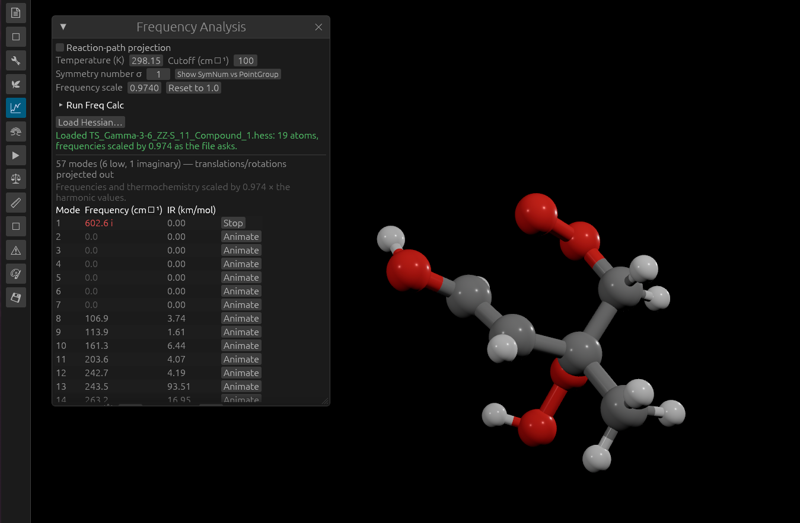

### Orbital Viewer

Loads a `.molden` file, evaluates the Gaussian basis on a grid, and meshes an
isosurface by marching cubes. Three quantities: a single molecular orbital,
the total electron density, or the spin density. Adjustable isovalue, grid
resolution, opacity, per-lobe colours, and a wireframe overlay. The sampled
field is retained, so dragging the isovalue slider only re-meshes rather than
re-evaluating the basis from scratch.

Open **Surface Tools**, click **Load Molden…**, and choose **Orbitals**,
**Electron density**, or **Spin density**. For an orbital, select a row in the
list and, for an open-shell calculation, choose **Alpha** or **Beta** spin.
Type an orbital number in **#** and press **Enter** to reveal it. Use **↑/↓**
(or the previous/next buttons) to move through the visible list; **Page Up/Down**
moves ten entries. **Filter** offers occupied/virtual orbitals and an inclusive
energy range in Hartree. Filtering preserves the original orbital numbers;
a direct index jump clears filters so the requested orbital is visible.
Adjust **Isovalue** and **Surface resolution**, then choose **Solid** or **Mesh**.
The orbital list fills the remaining window height, with **HOMO** and **LUMO**
marked on their rows. The default orbital isovalue is **0.07**; isovalue,
visibility and opacity stay above the list. **Surface detail and colors** opens
the resolution, solid/mesh style and lobe color controls.

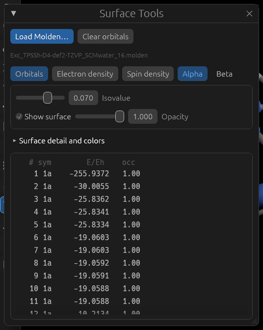

*Solid view with the selected orbital and separate colours for its two phases.*

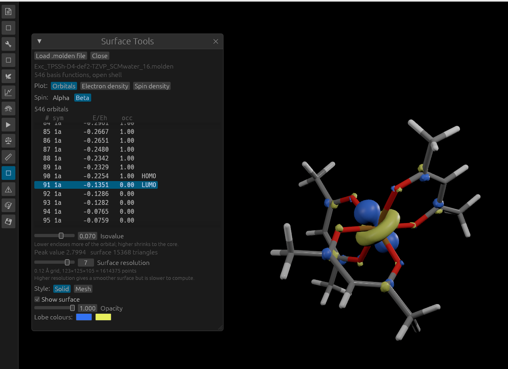

*Mesh view; use the mesh grid and line-width controls to adjust its appearance.*

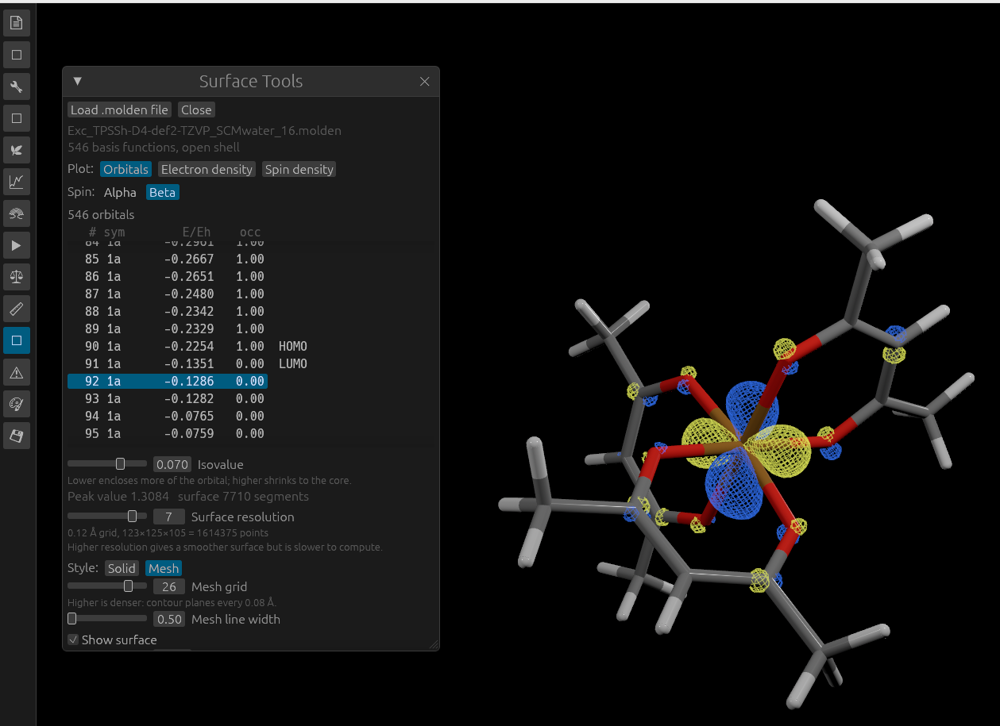

### UV-Vis

Reads excited states — energies and oscillator strengths — from an ORCA
TD-DFT output, and plots the absorption spectrum against wavelength or energy
with the same four line shapes UV-Vis needs, over a settable energy window.
The wavelength plot starts with a **5.0 nm** width. Export the curve for a figure.

Click **Load output…** to load excited states, expand a state to inspect
its orbital contributions, or click **Show Absorption Spectrum** to plot them.
Use **Matching Molden…** to pair the spectrum with its orbital file, or
**Link current orbitals** when Surface Tools already holds that calculation's
orbitals. Click either orbital number in an expanded contribution to open it
in Surface Tools. The display retains the output's numbering and maps it to
the appropriate file index, spin and (for Psi4) symmetry. Loading another
wavefunction invalidates the link. Runs that supply both a spectrum and
Molden orbitals link them automatically. Use the original canonical orbitals
from the same calculation.
**Calculate spectrum** opens the calculation controls; it stays open during a
run so the cancellation control remains available.

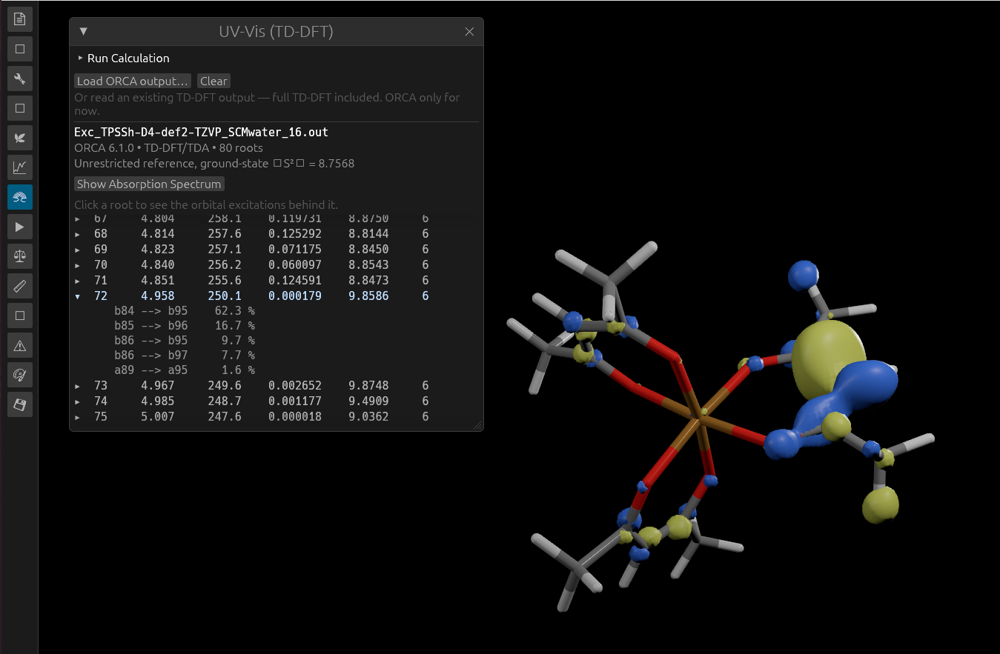

### Transition-State Initial Guess Generation

The **TS Generation** button on the left icon rail opens RDA and Poor Man's
NEB. Both use the Rust optimizers with energy and
gradient calculations supplied by an installed xTB executable.

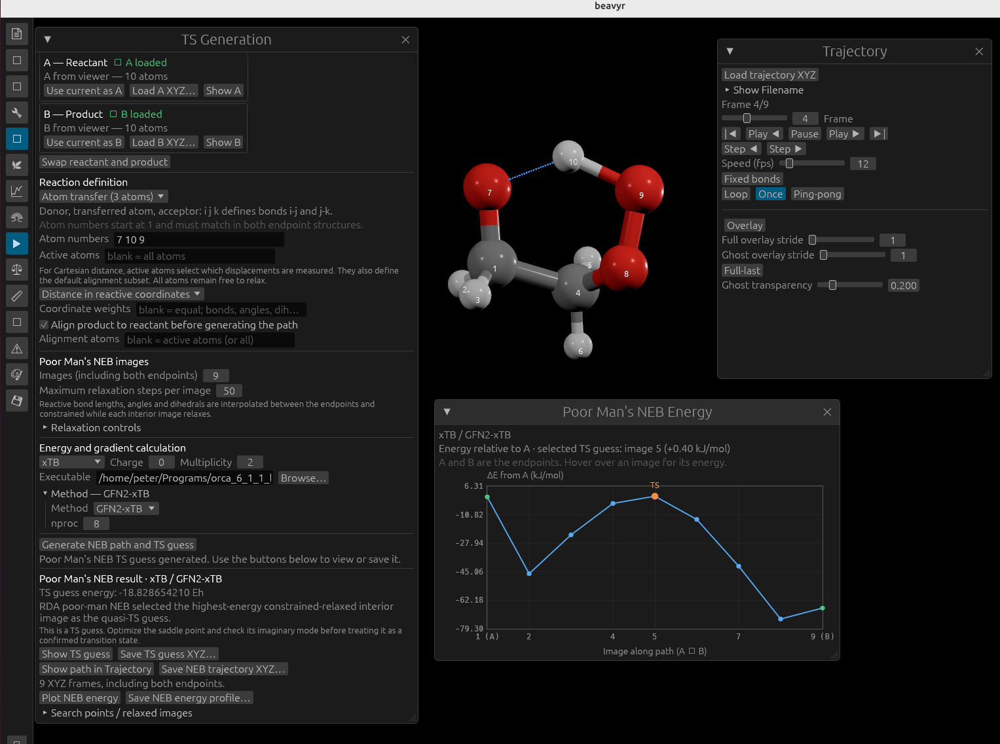

**How To Use** opens a guide with atom-number examples for every Reaction
definition, active atoms, alignment, coordinate weights, and the complete
workflow. Detailed RDA option explanations are in a section that starts collapsed.

1. Use **Load A/B XYZ** to load endpoint files, or draw/optimize the molecule
   in the viewer and press **Use current as A** (reactant). Then draw/optimize
   the second structure and press **Use current as B** (product). Each stored
   endpoint has a green loaded marker and a **Show A/B** button to display it
   again. Captures stay unchanged while you edit or optimize the viewer; capture
   again to keep those changes. Both endpoints must have the same atoms in the
   same order.
2. Define the reaction using one-based atom numbers: a bond change (two atoms),
   atom transfer (donor, transferred atom, acceptor), an angle, a dihedral, or
   custom reactive bonds/angles/dihedrals. RDA also supports Cartesian motion
   on selected active atoms. Active atoms select the distance/alignment subset;
   they are not frozen-atom constraints.
3. Select RDA or Poor Man's NEB and configure the backend, method, charge and
   multiplicity. RDA exposes beta bracketing, gamma search, distance and energy
   tolerances, coordinate mode and step limits in a section that starts collapsed.
   Poor Man's NEB exposes image
   count, constrained relaxation limits and additional connectivity.
4. Generate, then use **Show TS guess** or **Show path in Trajectory** to inspect
   the result. Calculations run in the background and can be cancelled.

**Save TS guess XYZ** writes one structure in Å. **Save NEB trajectory XYZ**
writes the complete multi-frame XYZ path, including both endpoints and all
constrained-relaxed interior images; each frame's comment includes its energy,
convergence status and whether it is the selected TS guess. The highest-energy
interior image is selected. **Plot NEB energy** opens a resizable energy plot
of all images, including A and B, relative to A in kJ/mol. The selected TS is
marked; hovering over an image shows its absolute and relative energies.
The NEB energy profile and RDA search structures
also have separate save buttons. These outputs are TS guesses; saddle-point
optimization and a frequency check are needed to establish a transition state.

### Conformational Analysis

Finds the low-energy shapes a flexible molecule can take, searching over its
rotatable bonds and, for a five- or six-membered ring, its pucker — a chair
against a twist-boat, or a sugar's envelopes and twists, not only what one
bond does. Runs on the built-in force field by default (seconds, no external
program), or on xTB — GFN-FF, GFN1, or GFN2 — for a slower, more careful
ranking of the same conformers.

Results load straight into the Trajectory tool to step through, or export as
a multi-frame XYZ. A "re-rank with xTB" button lets you sharpen the ordering
of just the best few conformers after a quick built-in search finds them.

For a transition state, the same tool can search over reactant conformers and
push each one over its barrier with an artificial force, collecting a set of
transition-state guesses that can have genuinely different active-bond
lengths — not the single length a conventional constrained search would be
stuck with.

Open **Conformer Search**, choose the energy method and search effort, then
click **Search for conformers**. The energy model and search effort have
separate sections, with three effort presets and visible core controls.
Use **View** beside a result to inspect it,
**Load as trajectory** to browse the set, or **Save as XYZ trajectory** to export it.

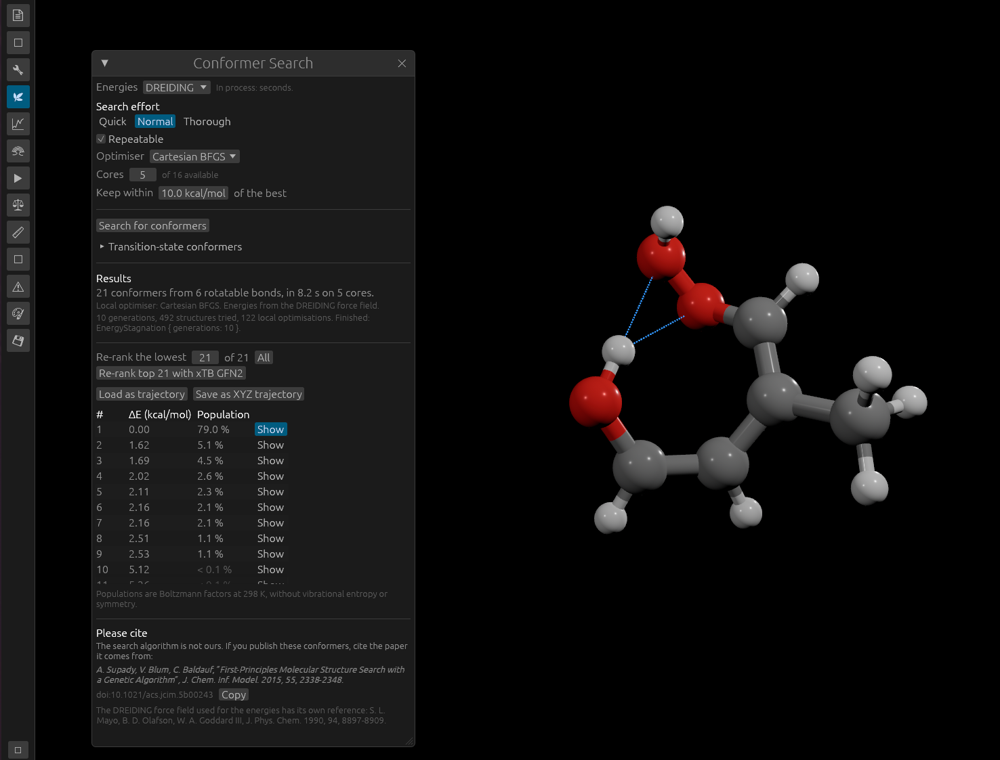

### Measurements

Distances, angles and dihedrals by clicking atoms. Left-drag orbits the
camera, so a click is distinguished from a drag by how far the pointer
travelled. Per-measurement and global styling, labels drawn next to the line.

Open **Measurements** and choose **New distance**, **New angle**, or
**New dihedral**, then click two, three, or four atoms respectively. Use
**Hide** or **Delete** beside a measurement to manage the labels on screen.
Each measurement type has its own section, with its picking action visible.

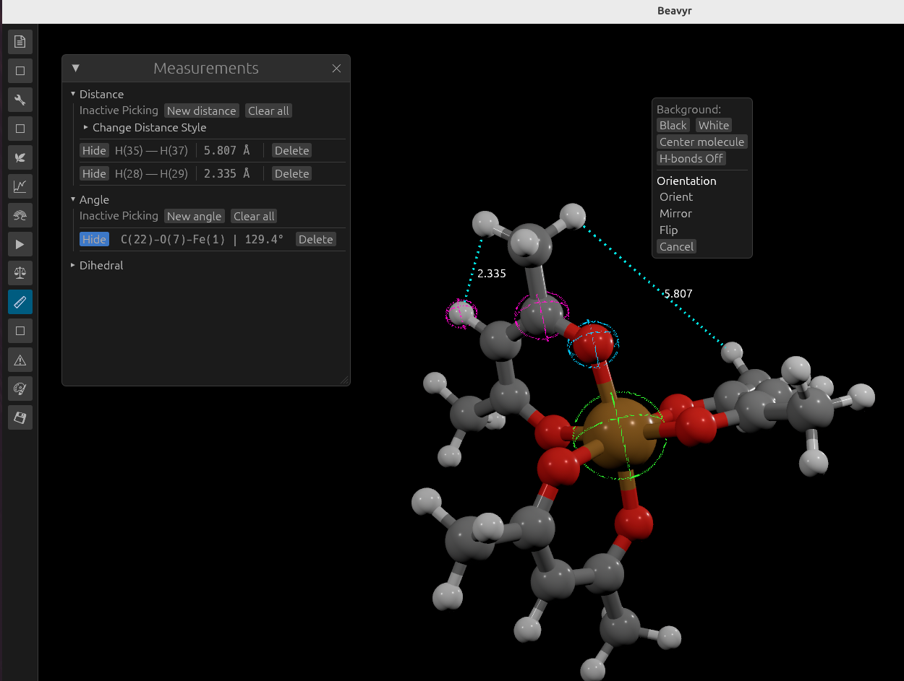

### Representation and Appearance

Six representations: ball-and-stick, rounded sticks, low-resolution balls and
lines, lines only, backbone trace, space-filling. Per-element visibility
filters, atom and bond scaling, bond radius as a fraction of the smaller
covalent radius, uniform or atom-split bond colours.

The Representation panel presents the six styles as a two-column chooser,
followed by the size and detail controls for the selected style. Appearance
opens **Colors and materials** first; **Atom and bond size**, **Lighting**, and
**Element visibility** have separate expandable sections.

Colour schemes: CPK, Jmol, VMD, Molden, Molden0, or a custom scheme you name,
save, and optionally load at startup. Material controls (metallic, roughness,
reflectance, emissive), an ambient light and a key/fill/rim rig, background
colour.

Hydrogen bonds are detected on a distance cutoff and drawn as dashed lines
with their own colour, thickness and dash geometry.

### Also included

* **Structure Comparison** — RMSD between frames or loaded structures, as
  placed and after optimal superposition. Pin any frame as the reference and
  see which atom moved furthest.
* **Diagnostics** — flags structures that are probably wrong before you spend
  time on them: close contacts, isolated atoms, and bond orders that sit
  between an element's common valences (a likely missing hydrogen), including
  a check for an odd number of electrons that means the molecule is a
  radical.
* **Export Image** — PNG or JPEG of the viewport, or of a selected area of
  it.

The Export Image panel groups **File format**, **Resolution**, and **Framing**.
Choose PNG or JPG, set the pixel dimensions and print DPI, then **Select area**
and drag a rectangle in the 3D view. **Export image** becomes available once
the region is selected; **Redraw area** and **Clear area** adjust the framing.

## Opening files

Beavyr takes filenames on the command line and loads each into the tool that
owns it:

```sh
beavyr ZZAllyl.xyz            # structure on screen
beavyr trajectory.xyz         # several frames: trajectory, ready to play
beavyr water.hess             # frequencies already analysed
beavyr mo.molden              # orbitals loaded
beavyr excited.out            # excited states, if the file has any
beavyr mol.xyz mo.molden      # several at once, each into its own tool
beavyr --help                 # the list of formats
```

`.xyz`, `.hess`, `.molden` and `.engrad` are recognised by name. `.out` and
`.log` are written by every program in the field, so those are decided by
looking inside: a Gaussian banner means frequencies, an absorption block means
excited states. A file that is neither says so rather than opening nothing —
an ORCA `Freq` output, in particular, is told that its force constants are in
the companion `.hess`.

Anything that fails is reported both in the terminal and at the top of the
Structure panel. Beavyr still opens: a bad argument is not a reason to refuse


## File formats

| Format | Read | Write |
|---|---|---|
| XYZ (single and multi-frame) | ✅ | ✅ |
| Molden | ✅ orbitals, basis, density | ✅ |
| ORCA `.hess` | ✅ Hessian, geometry, masses, frequencies, IR | — |
| ORCA `.engrad` | ✅ Cartesian gradient | — |
| ORCA output (`.out`) | ✅ excited states | — |
| Gaussian `.log` | ✅ frequencies, IR intensities, normal modes¹ | — |
| Turbomole `hessian` / `vibspectrum` (xTB) | ✅ | — |
| Spectra, thermochemistry | — | ✅ `.dat` |
| Viewport | — | ✅ PNG, JPEG |

¹ A plain Gaussian `Freq` job does not write the force-constant matrix; that
needs `iop(7/33=1)` or a formatted checkpoint. Beavyr reads the frequencies and
modes Gaussian printed.

## xTB

Beavyr's own force field handles geometry cleanup and conformer searching with
nothing to install. For quantum-chemistry results — optimisation, frequencies,
a better conformer ranking — point Beavyr at an
[xTB](https://xtb-docs.readthedocs.io/) executable once and the path is
remembered. Beavyr also reads output that **ORCA** or **Gaussian** already
produced; those are jobs you run yourself, not something a viewer launches.

## License

GPL-3.0. See `LICENSE`.

## Building from source

```sh
cargo run                                       # dev build, dynamic linking, fast rebuilds
cargo build --release --no-default-features     # standalone binary, no dynamic linking
cargo test -- --test-threads=1                   # run the tests serially
```

Cargo is limited to four build jobs by `.cargo/config.toml`. For a hard limit
of four CPU cores on Linux, prefix build, test and run commands with
`taskset -c 0-3` (or four CPU IDs allowed on your machine). Launched calculations
inherit that CPU limit.

The `dev` feature (on by default) enables Bevy's dynamic linking. Turn it off
for anything you intend to ship. Dependencies are built at `opt-level = 3`
even in a dev profile, because an unoptimised wgpu makes the viewer unusable.

Bevy is built with its 2D, 3D and UI features, with audio disabled at compile
time. Linux builds and packages therefore do not require ALSA.

Beavyr links no quantum-chemistry code of its own. Every external backend is
an executable you point it at, run in a scratch directory and parsed back
from its output files. That keeps the dependency list to five crates —
`bevy`, `bevy_egui`, `rfd`, `ndarray`, `anyhow` — with no BLAS and no Python.


## Implemented but not yet exposed

`src/vibronic/` is complete and tested but has no panel attached to it yet:

* **Franck-Condon activity** — projects an excited-state gradient taken at the
  ground-state geometry onto the ground-state normal modes, giving each mode's
  displacement, Huang-Rhys factor and resonance-Raman intensity in the
  short-time approximation. It needs no excited-state optimisation, which
  matters when an excited-state minimum is hard to converge.
* **Duschinsky rotation** — how the modes of one electronic state are built
  from the modes of another, for asking which ground-state mode an
  excited-state band descends from.

## Roadmap

- Simulated NMR spectra
- A UI for the vibronic analyses above
- File associations, so double-clicking an `.xyz` opens Beavyr
